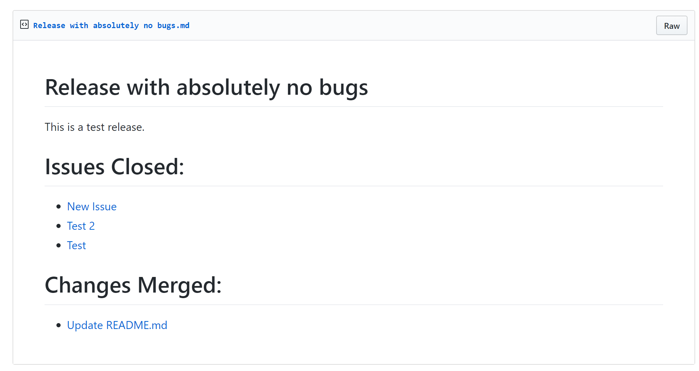
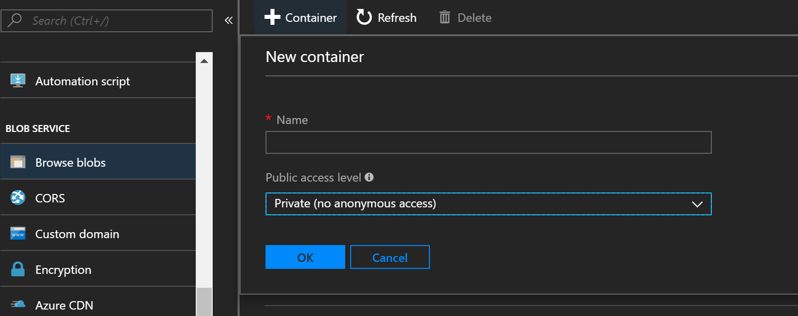
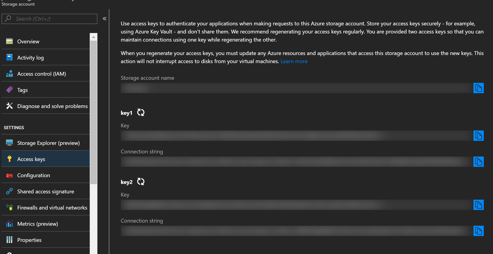
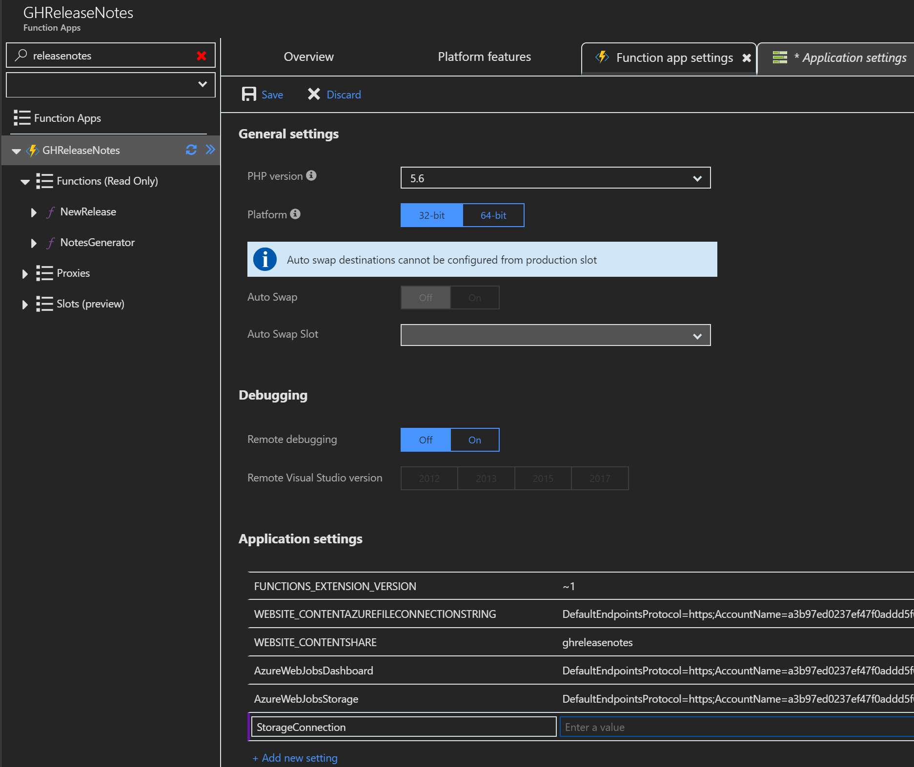
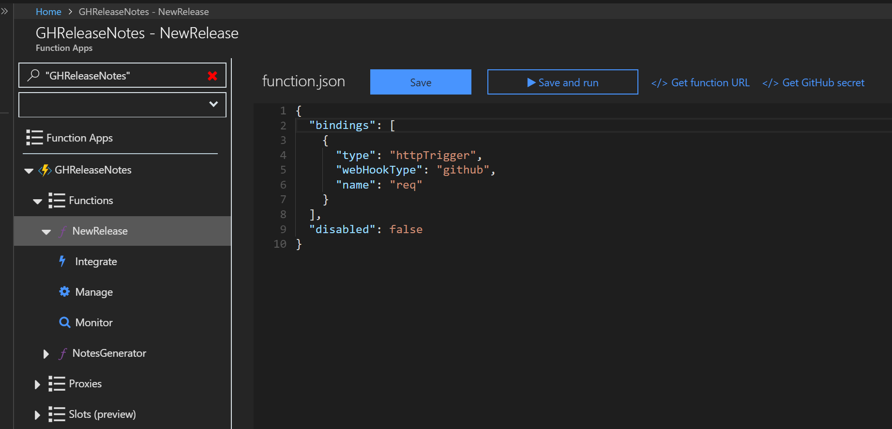
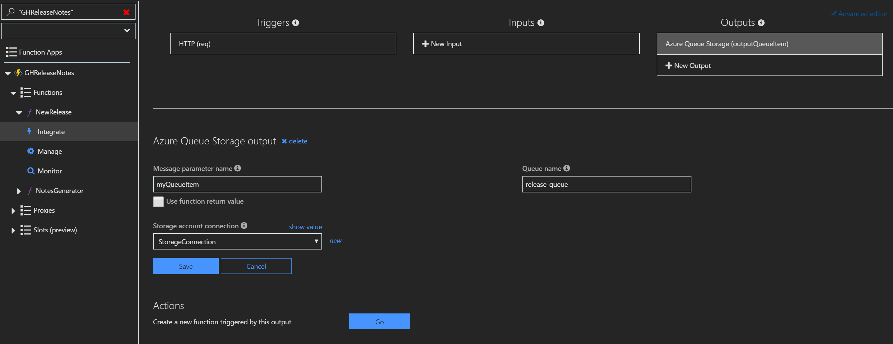
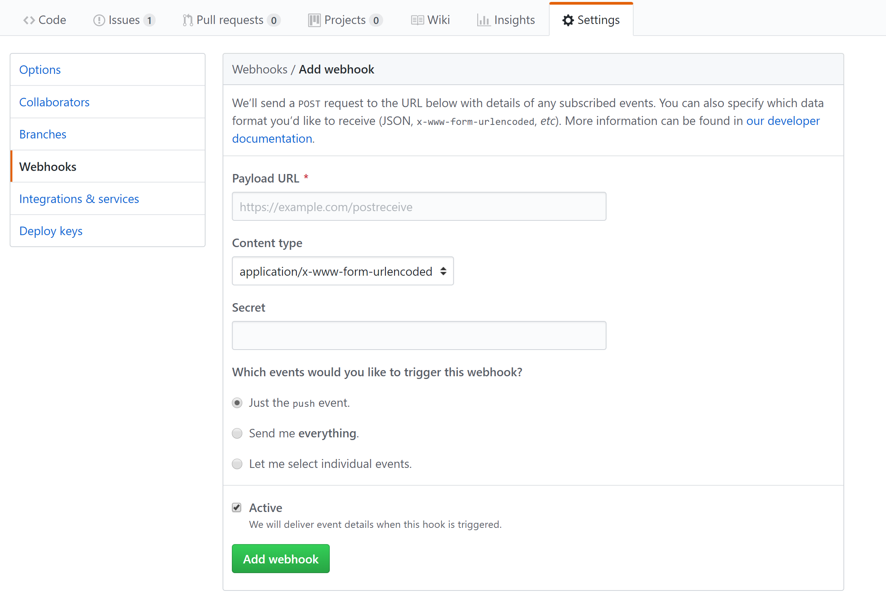
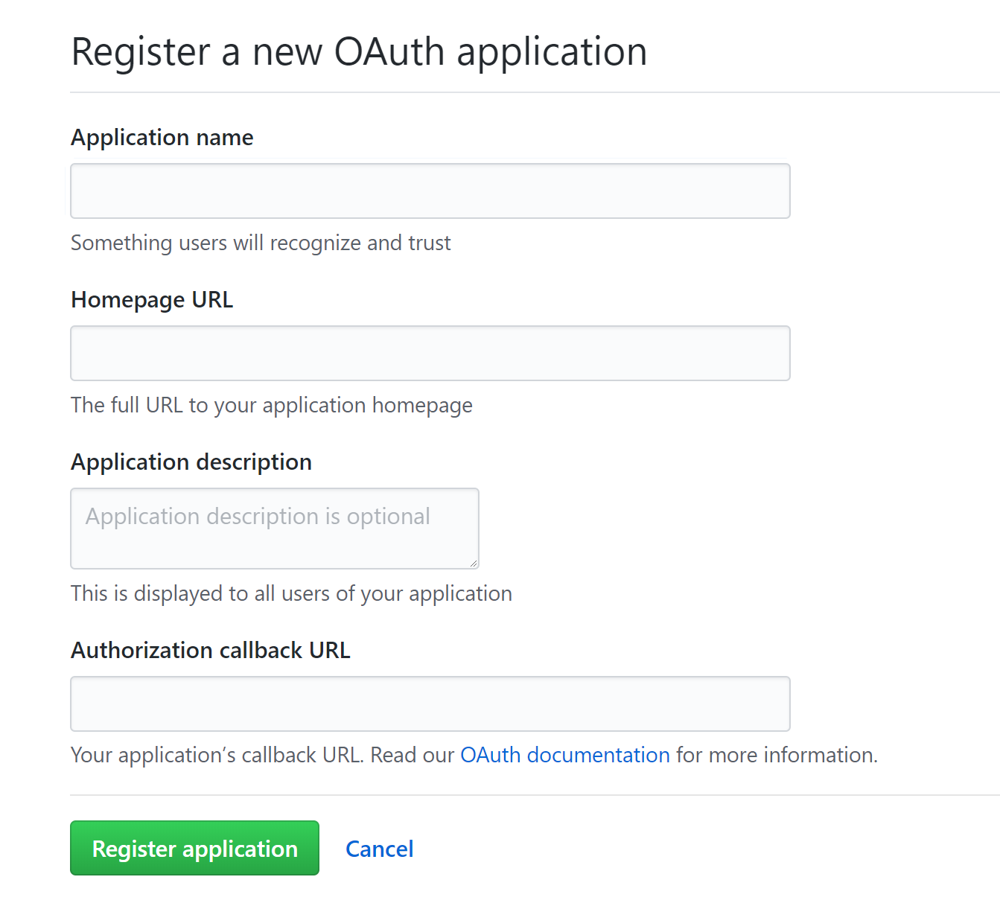
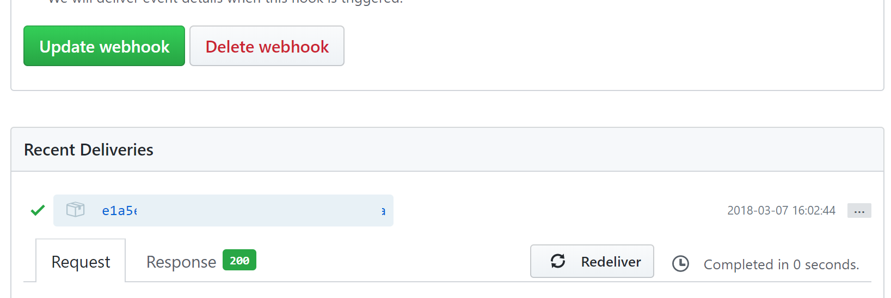

# GitHub Release Notes Generator

[!include[](../includes/header.md)]

The [The GitHub Release Notes Generator](https://github.com/paladique/release-notes-generator) is tool for generating a release notes document in conjunction with GitHub's release feature. 

[](https://azuredeploy.net/?repository=https://github.com/paladique/release-notes-generator)





## Requirements
* An [Azure](https://azure.microsoft.com/en-us/free/) account
* A [GitHub](https://github.com/join) account

## Links
* [Release Notes Repo](https://github.com/paladique/release-notes-generator)

## What's It Do?
The generator is a [function app](https://docs.microsoft.com/en-us/azure/azure-functions/functions-overview) containing two functions:

- A [GitHub webhook](https://docs.microsoft.com/en-us/azure/azure-functions/functions-create-github-webhook-triggered-function) triggered when a new release is created, that sends a message to a queue.
- A [queue trigger](https://docs.microsoft.com/en-us/azure/azure-functions/functions-create-storage-queue-triggered-function) that uses the message sent from the webhook to create a markdown file with the repository's Issues and Pull Requests from the last two weeks, using the [Octokit.NET](https://github.com/octokit/octokit.net) library.

## Steps
1. Navigate to the Azure Portal and create a storage account. See the [Create a storage account quickstart](https://docs.microsoft.com/en-us/azure/storage/common/storage-quickstart-create-account?tabs=portal#create-a-general-purpose-storage-account) to get started. 
1. Navigate to the new storage account, navigate to the **Blob Service** section, select **Browse Blobs**, then click the **Add Container** button at the top to create a blob container named `releases`. See section on how to [create a container](https://docs.microsoft.com/en-us/azure/storage/blobs/storage-quickstart-blobs-portal#create-a-container) for more information. 
1. In the same storage account menu, navigate to the **Queue Service** section, select **Browse Queues**, then click the **Add Queue** button at the top to create a queue named `release-queue`.
1. In the same storage account menu, navigate to **Access keys** and copy the connection string. 
1. Create a function app. See section on how to [create a function app](https://docs.microsoft.com/en-us/azure/azure-functions/functions-create-first-azure-function#create-a-function-app) to get started.
1. Navigate to the new function, from the overview, click and open **Application settings**, scroll to and click **+ Add new setting**. Name the setting `StorageConnection` and paste the copied connection string into the value field. Click **Save** 
1. In the function app, add a C# GitHub webhook function. See section on how to [Create a GitHub webhook triggered function](https://docs.microsoft.com/en-us/azure/azure-functions/functions-create-github-webhook-triggered-function#create-a-github-webhook-triggered-function) to get started.

1. Replace initial code with the following:

```csharp
using System.Net;

public static async Task Run(HttpRequestMessage req, ICollector<string> releaseQueueItem, TraceWriter log)
{
    // Get request body
    dynamic data = await req.Content.ReadAsAsync<object>();

    // Extract github comment from request body
    string releaseBody = data?.release?.body;
    string releaseName = data?.release?.name;
    string repositoryName = data?.repository?.full_name;

    //Format message and send to queue
    var releaseDetails = string.Format("{0}|{1}|{2}", releaseName, releaseBody, repositoryName);
    releaseQueueItem.Add(releaseDetails);
}
```

1. In your new function, copy the url by clicking click **</> Get function URL**, and save for later. Repeat for **</> Get GitHub secret**. You will use these values to configure the webhook in GitHub. 
1. Expand the function's context menu, navigate to **Integrate** .
1. Add a new queue storage output. Set the queue name to `release-queue`, Message parameter name to `myQueueItem`, and Storage account connection to `StorageConnection` 
1. Navigate to GitHub and select the repository to use with webhook. Navgiate to the repository's settings.
1. In the menu on the left of the repository settings, select webhooks and click **add a webhook** button. 
1. Follow the table to configure your settings:

| Setting | Suggested value | Description |
|---|---|---|
| **Payload URL** | Copied value | Use the value returned by  **</> Get function URL**. |
| **Content type** | application/json | The function expects a JSON payload. |
| **Secret**   | Copied value | Use the value returned by  **</> Get GitHub secret**. |
| Event triggers | Let me select individual events | We only want to trigger on release events.  |
| | Releases |  |

1. Click **add webhook**.
1. Navigate to your GitHub user settings, then to **Developer Applications**. Click **New OAuth App** and create an app with a homepage url and callback url of your choice. They will not be used. Copy and save the application name for later use. 
1. Navigate back the portal and return to the function app's Application Settings tab. Add a setting named `ReleaseNotesApp`, with the value as the name of the application created in the previous step. Click **Save**.
1. In the same function app, create a C# queue trigger function. Replace initial code with the following:

```csharp
#r "Microsoft.WindowsAzure.Storage"
using System;
using Microsoft.WindowsAzure.Storage.Blob;
using Octokit;

public static async Task Run(string myQueueItem, CloudBlockBlob blobContainer, TraceWriter log)
{
    //Parse queue message
    var releaseDetails = myQueueItem.Split('|');
    var releaseName = releaseDetails[0];
    var releaseBody = releaseDetails[1];
    var repoName = releaseDetails[2];

    //Get issues and pull requests from release repo
    string txtIssues = await GetReleaseDetails(IssueTypeQualifier.Issue, repoName);
    string txtPulls = await GetReleaseDetails(IssueTypeQualifier.PullRequest, repoName);

    //Get reference to blob container
    var myBlobContainer = blobContainer.Container;
    var releaseText =  String.Format("# {0} \n {1} \n\n" + "# Issues Closed:" + txtIssues + "\n\n# Changes Merged:" + txtPulls, releaseName,releaseBody);

    //Create a blob with the release name as the file name and append formatted release notes
    var blob = myBlobContainer.GetAppendBlobReference(releaseName + ".md" );
    await blob.UploadTextAsync(releaseText);
}

public static async Task<string> GetReleaseDetails(IssueTypeQualifier type, string repo)
{
    //Create GitHub Client
    var github = new GitHubClient(new ProductHeaderValue(Environment.GetEnvironmentVariable("ReleaseNotesApp")));
    var span = DateTime.Now.Subtract(TimeSpan.FromDays(14));
    var request = new SearchIssuesRequest();

    request.Repos.Add(repo);
    request.Type = type;

    //Search closed issues or merged pull requests
    var qualifier = (type == IssueTypeQualifier.Issue) ? request.Closed : request.Merged;
    qualifier = new DateRange(span, SearchQualifierOperator.GreaterThan);
    var issues = await github.Search.SearchIssues(request);

    string searchResults = string.Empty;
    foreach(Issue x in issues.Items)
    {
      searchResults += String.Format("\n - [{0}]({1})", x.Title, x.HtmlUrl);
    }

    return searchResults;
}
```

1. Navigate to queue trigger, add a blob binding to function.json. It should look similar to this:

```
  {
  "bindings": [
    {
      "name": "myQueueItem",
      "type": "queueTrigger",
      "direction": "in",
      "queueName": "release-queue",
      "connection": "StorageConnection"
    },
    {
      "name": "blobContainer",
      "type": "blob",
      "direction": "inout",
      "path": "releases/*",
      "connection": "StorageConnection"
    }
  ],
  "disabled": false
}
```

1. In the same function, upload or create a project.json file and add the following:

```
{
  "frameworks": {
    "net46":{
      "dependencies": {
        "Octokit": "0.29.0"
      }
    }
   }
}
```

## Test the application
Create a new release in the repository. Fill out the required fields and click **Publish release**. The generated blob will be a markdown file named as the release title.
Monitor and review the functions' execution history in the **Monitor** context menu of the function. 

To run the function again without creating another release, go to the configured webhook in GitHub to redeliver it. 

## Next Steps
The following is additional information on the Azure services used in this demo.
* [Introduction to Azure Functions](https://docs.microsoft.com/en-us/azure/azure-functions/functions-overview)
* [Azure Functions triggers and bindings concepts](https://docs.microsoft.com/en-us/azure/azure-functions/functions-triggers-bindings)
* [Azure Functions C# script (.csx) developer reference](https://docs.microsoft.com/en-us/azure/azure-functions/functions-reference-csharp)
* [OctoKit.NET](https://octokit.github.io/)