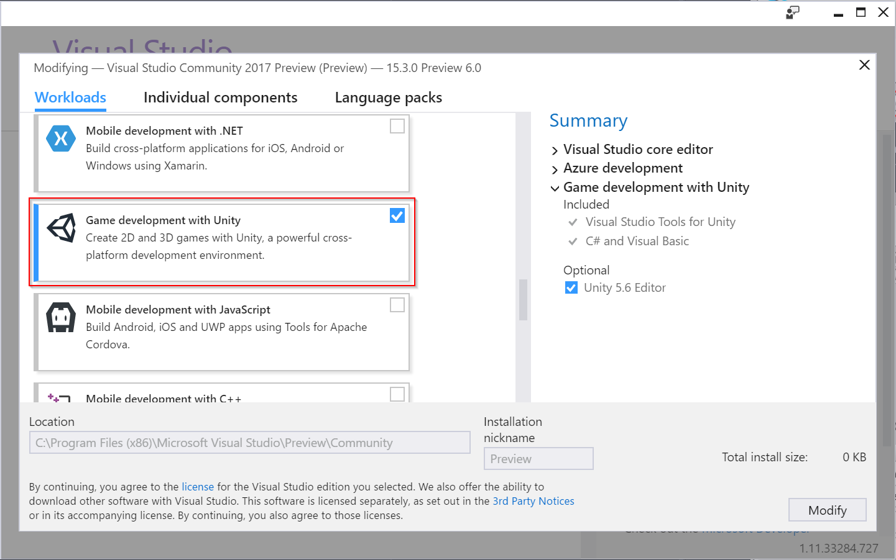
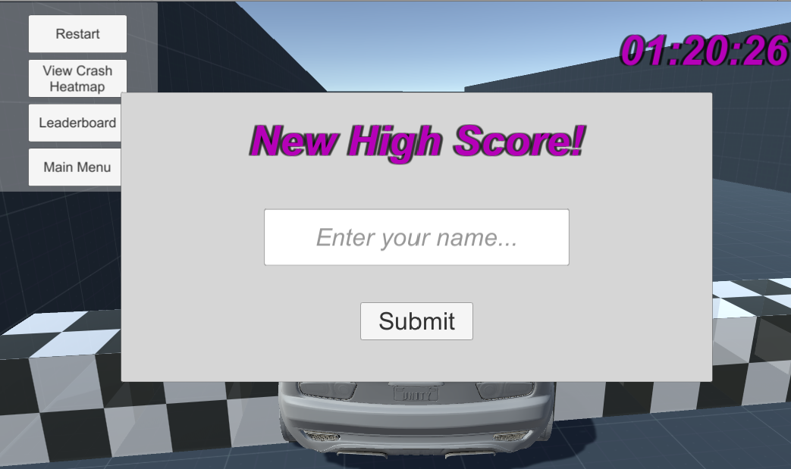
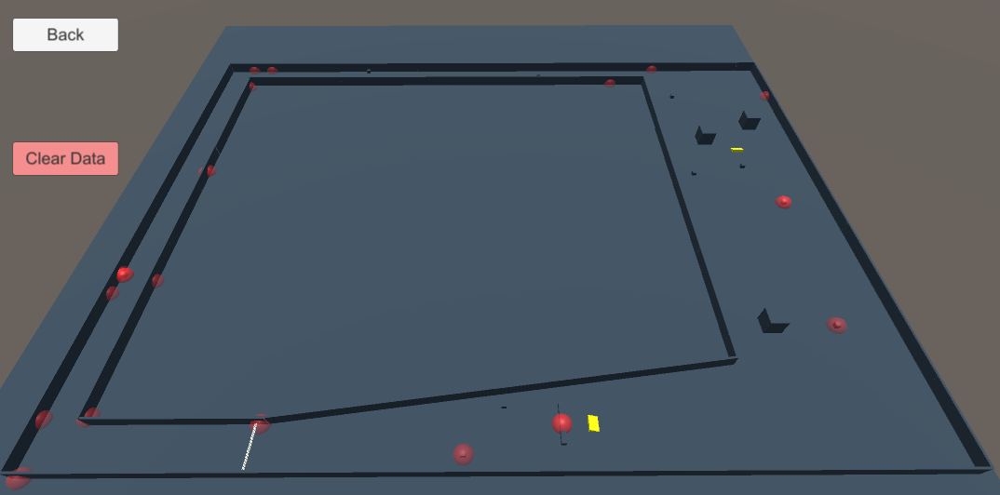

# Use Azure Easy Tables and the Mobile Apps SDK with Unity

[!include[](../../../includes/header.md)]

[](https://aka.ms/azsamples-unity)

Azure provides a scalable solution to storing telemetry and other game data in the cloud. With the release of Unity 2017, Unity's experimental support for .NET 4.6 makes Azure integration simpler than ever.

This sample will walk through the process of using Easy Tables to save telemetry and leaderboard data in Azure using the experimental [Mobile Apps SDK for Unity](/sandbox/gamedev/unity/azure-mobile-apps-unity).


## Requirements

* [Unity 2017.1 (or greater)](https://unity3d.com/)
* [An Azure account (Sign up for free!)](https://aka.ms/azfreegamedev)

> [!NOTE]
> This project requires the "experimental" .NET 4.6 Mono scripting runtime in Unity 2017. [Unity has stated that soon this will be the default](https://forum.unity3d.com/threads/future-plans-for-the-mono-runtime-upgrade.464327/), however for now, it is still labeled as "experimental" and you may experience issues.
>
> In addition, we will be using an experimental Azure Mobile Client SDK in this tutorial, and, as such, this may not build and run on every single Unity platform.  Please see the [Azure Mobile Apps SDK for Unity](/sandbox/gamedev/unity/azure-mobile-apps-unity) article for a list of known working platforms and issues.

## Configure Easy Tables in Azure

Easy Tables are a feature of [Azure Mobile Apps](https://azure.microsoft.com/services/app-service/mobile/) that allow setup and management of SQL tables directly in the Azure portal GUI. Azure Mobile Apps support many features, but the scope of this example is limited to reading and writing data stored in an Azure Mobile App backend from a Unity project.

[!include[](include/racer_configure-easy-tables.md)]

## Prepare the development environment

There are some prerequisites to using the exerpimental Azure Mobile Client SDK in Unity.

### Download and install Unity 2017

Unity 2017.1 or higher is required. All Unity plans work with the walkthrough, including the free Personal plan. You can download Unity from [https://store.unity.com/](https://store.unity.com/).

### Download and install Visual Studio 2017

The walkthrough requires Visual Studio 2017 15.3 or above, with the game development with Unity workload. All editions of Visual Studio 2017 work with the walkthrough, including the free Community edition.

1. Download Visual Studio 2017 at [https://www.visualstudio.com/](https://www.visualstudio.com/).

1. Install Visual Studio 2017 and ensure that the **Game development with Unity** workload is enabled.

   

   > [!NOTE]
   > If Visual Studio 2017 is already installed, you can view and modify workloads by running the Visual Studio Installer.

### Download the project

This project is located in the [AzureSamples-Unity repo](https://aka.ms/azsamples-unity) on GitHub.  On the GitHub site, click the **Clone or download** button to get a copy of the code to work with.

## Project Walkthrough

This is a large project, so we will explore the important parts that demonstrate how to use Easy Tables with Unity.

### Unity scripting runtime

The Azure Mobile Client SDK and its dependencies require the .NET 4.6 runtime.  This is set in the project settings.

1. From the Unity **Edit** menu, choose **Project Settings > Player**.

1. The Player Settings opens in the Unity Inspector window. Under the **Configuration** heading in the **Other Settings** section, click the **Scripting Runtime Version** dropdown and select **Experimental (.NET 4.6 Equivalent)**. This will prompt a dialog asking to restart Unity. Select **Restart**.

   

## CrashInfo and HighScoreInfo classes

The Unity project must contain data model classes that correspond with the tables created in the Azure Mobile App backend.  You can find these in the **Assets/Scripts/Data Models** directory in the project.

The **CrashInfo**  class looks like this:

```csharp
public class CrashInfo
{
    public string Id { get; set; }
    public float X { get; set; }
    public float Y { get; set; }
    public float Z { get; set; }
}
```

And the **HighScoreInfo** class looks like this:

```csharp
public class HighScoreInfo
{
    public string Name { get; set; }
    public float Time { get; set; }
    public string Id { get; set; }
}
```

> [!NOTE]
> For Easy Tables to work, the name of the data model classes must match the name of the Easy Table created on the Azure Mobile App backend.

## The Azure MobileServiceClient

Central to the Azure Mobile Client SDK is the [MobileServiceClient](https://docs.microsoft.com/en-us/dotnet/api/microsoft.windowsazure.mobileservices.mobileserviceclient?view=azure-dotnet), which allows access to your Mobile App backend.  To use this, you will need the URL of your mobile service backend.

### Locate the URL of the Mobile App backend

The `MobileServiceClient` constructor takes the Mobile App URL as a parameter, so before going forward, locate the URL.

1. In the Azure portal, click the **App Services** button.

   

1. Click the entry for your Mobile App.

   

1. Copy the URL of your Mobile App backend.

   

### The MobileServiceClient singleton

There should only be a single instance of `MobileServiceClient`, so the walkthrough uses a variation of the singleton pattern.

1. Inside of the **Assets/Scripts** directory of your Unity project, look for the C# script named **AzureMobileServiceClient**.

   ```csharp
   using Microsoft.WindowsAzure.MobileServices;

   public static class AzureMobileServiceClient
   {
       private const string backendUrl = "MOBILE_APP_URL";
       private static MobileServiceClient client;

       public static MobileServiceClient Client
       {
           get
           {
               if (client == null)
                   client = new MobileServiceClient(backendUrl);

               return client;
          }
       }
   }
   ```

1. In the preceding code, replace `MOBILE_APP_URL` with the URL of your Mobile App backend, however ensure you are using the **http://** endpoint and not **https://**.

>[!NOTE]
>Due to a Unity limitation, HTTPS requests using the standard .NET networking stack (i.e. not using UnityWebRequest) will fail.  To workaround this, you will need to use the **http** version of the Mobile Apps endpoint instead of **https**.  **This means your data will not be encrypted to and from the server.**

## Test the client connection

Now that the `AzureMobileServiceClient` singleton is created, it's time to test the client connection.  This is done with the **TestClientConnection.cs** script located in the **Scripts** directory.  To use it, do the following:

1. Open the **TestScene** scene located in the **Assets/Scenes** directory.  An instance of the **TestClientConnection** script is attached to the **Main Camera** GameObject.

1. Click the **Play** button in Unity and observe the **Console** window to confirm that none of the assertions have failed.

   >[!NOTE]
   >The App Service will time out after a period of inactivity. It may take a moment to spin back up when it is hit again, so if the first test fails, please try one more time to ensure the service is in its running state. Alternatively, use a web browser to visit the service's URL from above and wait for the page to be returned before running the test in Unity.

1. Open the **CrashInfo** Easy Table on the Azure portal. It should now have an entry with **X,Y,Z** coordinates of **(1, 2, 3)** and a value of **true** for in the **deleted** column. Each time you run the test, a new entry with the same values but a unique ID should be added to the table.

  

## Test the sample game

The sample game is a simple racing game that records data about the player's behavior and stores it in Azure Easy Tables. The sample game also includes scenes that read the data from Azure and visualize it for the player.

This section will simply explain how to play the sample game and ensure it's functioning correctly. The next sections will go into more detail explaining how the sample game works.

## Export for target platform

In addition, you can export and run the Unity game on a target platform.  The experimental Mobile Apps SDK supports the most popular Unity targets.  Please check the [Azure Mobile Apps SDK for Unity](/sandbox/gamedev/unity/azure-mobile-apps-unity) article to see which platforms are supported and any known issues for exporting to those platforms.

### Starting the game

1. In the Unity Project window, navigate to the **Assets/Scenes** folder.

1. Double click the **MenuScene** to open it.

1. In the Unity Game window, click the **aspect ratio dropdown** and choose **16:9**.

   

1. Click the **Play** button to run the game in the Unity editor.

### Complete a race

Before viewing the leaderboard or heatmap, it's best to create some sample data by completing the race at least once.

1. With the game running in the Unity editor, click the **Race!** button to start a new race.

1. Use **WASD** or the **arrow keys** to drive the car and complete a clockwise lap around the track. For the sake of example, be sure to crash into some walls along the way. Debug output in the Unity console should indicate when a collision has been recorded.

   >[!NOTE]
   > If you manage to flip the car and are unable to continue, click **Restart**. Data is only sent to Azure upon completing a lap.

   

1. After crossing the checkered finish line, the game should display a **Finished** message. At this point, crash data will be uploaded to Azure.

1. If you have completed one of the top 10 fastest lap times, you will be prompted to enter a name for a high score. Enter your name and click **Submit**.

   

### View the heatmap

1. Click the **View Crash Heatmap** button from the race scene or select **Crash Heatmap** from the main menu.

1. The heatmap scene loads data from the CrashInfo table in Azure and displays a transparent red sphere at locations where players have collided with the walls of the race track. If multiple crashes occur in an overlapping area, the spheres should appear brighter.

   

### View the leaderboard

1. Click the **Leaderboard** button from the race scene or main menu.

1. The leaderboard scene loads high score data from the HighScoreInfo table in Azure and displays a player name and lap time for each high score entry.

   

## RaceScene explanation

The RaceScene uses Unity [Standard Assets](https://www.assetstore.unity3d.com/en/#!/content/32351) to compose the basic racing gameplay and level.

### RecordCrashInfo script

This script checks for crashes in `OnCollisionEnter` and records them to a list. `crashRecordingCooldown` and `crashRecordingMinVelocity` limit what the game considers a crash in order to keep a relevant data set.

When the `RaceFinished` event is raised, `UploadNewCrashDataAsync` sends each crash in the list to the CrashInfo Easy Table on Azure.  Here are some abbreviated snippets from the `RecordCrashInfo` script showing this in action.

```csharp
private List<CrashInfo> newCrashes = new List<CrashInfo>();

private void OnCollisionEnter(Collision collision)
{
    if (!isRaceFinished && collision.gameObject.tag == "Wall" && !isOnCooldown && meetsMinVelocity)
    {
        Debug.Log("Collided with wall!");
        newCrashes.Add(new CrashInfo
        {
            X = collision.transform.position.x,
            Y = collision.transform.position.y,
            Z = collision.transform.position.z
        });
    }
}

// called by the Checkpoint.RaceFinished event handler
private void OnRaceFinished()
{
    Task.Run(UploadNewCrashDataAsync);
}

private async Task UploadNewCrashDataAsync()
{
    var crashTable = AzureMobileServiceClient.Client.GetTable<CrashInfo>();

    try
    {
        Debug.Log("Uploading crash data to Azure...");
        foreach (var item in newCrashes)
            await crashTable.InsertAsync(item);
        Debug.Log("Finished uploading crash data.");
    }
    catch (System.Exception e)
    {
        Debug.Log("Error uploading crash data: " + e.Message);
    }
}
```

## RecordHighScore script

This script checks to see if the player has earned a new high score. If they have, it displays the `enterNamePopup`, which allows the player to enter their name and click **Submit**.

Once a player name is submitted, `UploadNewHighScoreAsync` is called and the new high score is sent to the HighScoreInfo Easy Table on Azure.  Here are the important parts:

```csharp
private List<HighScoreInfo> highScores;
private string playerName = string.Empty;

private async void Start()
{
    highScores = await Leaderboard.GetTopHighScoresAsync();
}

private async void OnAfterMostRecentScoreSet(float newScore)
{
    bool isNewHighScore = CheckForNewHighScore(newScore);

    if (isNewHighScore)
    {
        Debug.Log("New High Score!");
        await GetPlayerNameAsync();
        await UploadNewHighScoreAsync(newScore);
    }
    else
        Debug.Log("No new high score.");
}

private bool CheckForNewHighScore(float newScore)
{
    Debug.Log("Checking for a new high score...");
    bool isHighScoreListFull = highScores.Count >= Leaderboard.SizeOfHighScoreList;
    var lowerScores = highScores.Where(x => x.Time > newScore);

    return lowerScores.Count() > 0 || !isHighScoreListFull;
}

private async Task UploadNewHighScoreAsync(float newScore)
{
    var newHighScoreInfo = new HighScoreInfo { Name = playerName, Time = newScore };

    try
    {
        Debug.Log("Uploading high score data to Azure...");
        await Leaderboard.HighScoreTable.InsertAsync(newHighScoreInfo);
        Debug.Log("Finished uploading high score data.");
    }
    catch (System.Exception e)
    {
        Debug.Log("Error uploading high score data: " + e.Message);
    }
}
```

## HeatmapScene script

The HeatmapScene contains an instance of the **LevelGeometry** prefab. This way the coordinates for crashes loaded from Azure map correctly to the level art.

### InitializeCrashListAsync method

`InitializeCrashListAsync` connects to the CrashInfo Easy Table on Azure and uses `ToListAsync` to add all of its entries to a List object.

```csharp
private async Task InitializeCrashListAsync()
{
     Debug.Log("Downloading crash data from Azure...");

     for (int i = 0; i < numberOfAttempts; i++)
     {
         try
         {
             Debug.Log("Connecting... attempt " + (i +1));
             crashesFromServer = await crashesTable.ToListAsync();
             Debug.Log("Done downloading.");
             return;
         }
         catch (System.Exception e)
         {
             Debug.Log("Error connecting: " + e.Message);
         }

         if (i == numberOfAttempts - 1)
             Debug.Log("Connection failed. Check logs, try again later.");
         else
             await Task.Delay(500);
     }
 }
```

### DeleteCrashDataAsync method

`DeleteCrashDataAsync` is called when the user presses the **Clear Data** button. It iterates through the local list of crashes and calls `DeleteAsync` for each entry. This sets each entry's **Deleted** column in the Easy Table to **true**. `ToListAsync` ignores these deleted entries.

```csharp
public async void DeleteCrashDataAsync()
{
    Debug.Log("Deleting crash data...");
    foreach (var item in crashesFromServer)
    {
        try
        {
            await crashesTable.DeleteAsync(item);
        }
        catch (System.Exception e)
        {
            Debug.Log("Error deleting crash data: " + e.Message);
        }
        Debug.Log("Done deleting crash data.");
    }
    SceneManager.LoadScene(SceneManager.GetActiveScene().name);
}
```

## Leaderboard script

The `Leaderboard` class uses an `async Start` function, which is still called when the script is enabled, just like a typical Unity `Start` function.

`DownloadHighScoresAsync` uses the `Sort` and `GetRange` functions to sort the high scores in the Azure Easy Table and only take the top entries based on the `SizeOfHighScoreList` constant, which are stored in the `highScoreList` list.

```csharp
public class Leaderboard : MonoBehaviour
{
    public const int SizeOfHighScoreList = 10;
    private static int numberOfAttemptsToLoadData = 3;
    private static IMobileServiceTable<HighScoreInfo> highScoreTable_UseProperty;

    public static IMobileServiceTable<HighScoreInfo> HighScoreTable
    {
        get
        {
            if (highScoreTable_UseProperty == null)
                highScoreTable_UseProperty = AzureMobileServiceClient.Client.GetTable<HighScoreInfo>();

            return highScoreTable_UseProperty;
        }
    }

    public static async Task<List<HighScoreInfo>> GetTopHighScoresAsync()
    {
        return await DownloadHighScoresAsync(true);
    }

    private static async Task<List<HighScoreInfo>> DownloadHighScoresAsync(bool onlyTopEntries)
    {
        List<HighScoreInfo> highScoreList;

        Debug.Log("Downloading high score data from Azure...");

        for (int i = 0; i < numberOfAttemptsToLoadData; i++)
        {
            try
            {
                Debug.Log("Connecting... attempt " + (i + 1));

                if (onlyTopEntries)
                {
                    // NOTE: We'd normally use OrderBy here, however that uses reflection
                    // and DynamicInvoke which are not supported in IL2CPP exports for Unity
                    // That means using OrderBy would stop this from wokring on iOS 
                    // (and other platforms where IL2CPP is used)
                    List<HighScoreInfo> list = await HighScoreTable.ToListAsync();
                    list.Sort((a,b) => a.Time.CompareTo(b.Time));
                    highScoreList = list.GetRange(0, list.Count > SizeOfHighScoreList ? SizeOfHighScoreList : list.Count);
                }
                else
                    highScoreList = await HighScoreTable.ToListAsync();

                Debug.Log("Done downloading high score data.");
                return highScoreList;
            }
            catch (Exception e)
            {
                Debug.Log("Error connecting: " + e.Message);
            }

            if (i == numberOfAttemptsToLoadData - 1)
                Debug.Log("Connection failed. Check logs, try again later.");
            else
                await Task.Delay(500);
        }

        // If we can't successfully download a list from the server,
        // just make a new one to fail more gracefully.
        return highScoreList = new List<HighScoreInfo>();
    }

    private async void Start()
    {
        var highScores = await GetTopHighScoresAsync();

        if (highScores.Count == 0)
            ShowEmptyLeaderboardMessage();
        else
        {
            loadingText.gameObject.SetActive(false);

            foreach (var item in highScores)
            {
                var row = Instantiate(rowPrefab, this.transform).GetComponent<LeaderboardRow>();
                row.HighScoreInfo = item;
            }
        }
    }

    private void ShowEmptyLeaderboardMessage()
    {
        loadingText.text = "The leaderboard is empty!";
    }

    public static async Task DeleteAllEntriesAsync()
    {
        Debug.Log("Deleting leaderboard data...");

        var fullHighScoreList = await DownloadHighScoresAsync(false);

        foreach (var item in fullHighScoreList)
        {
            try
            {
                await HighScoreTable.DeleteAsync(item);
            }
            catch (Exception e)
            {
                Debug.Log("Error deleting leaderboard data: " + e.Message);
            }
        }
    }
}
```

## Next Steps

* [Azure Mobile Apps SDK for Unity](/sandbox/gamedev/unity/azure-mobile-apps-unity)
* [Other Unity SDKs for Azure](/sandbox/gamedev/)
* [Mobile Apps Documentation](/azure/app-service-mobile/)
* [Azure Samples with Unity](https://aka.ms/azsamples-unity)
